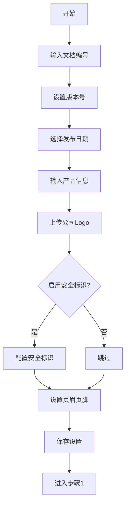
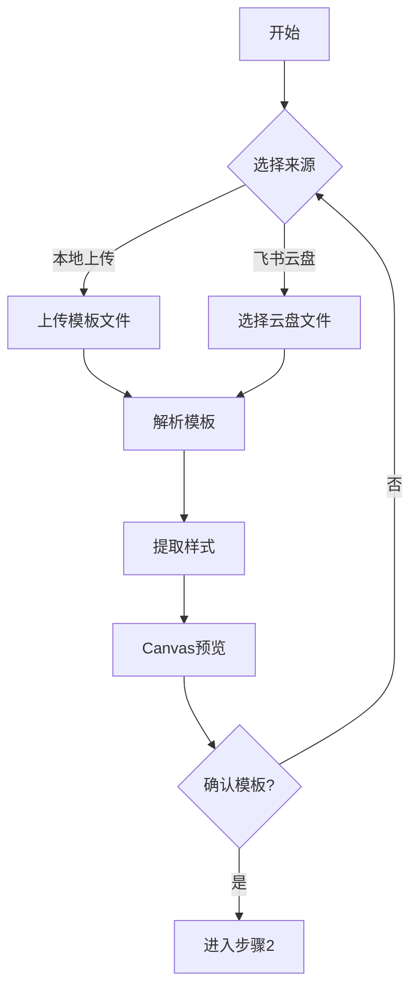
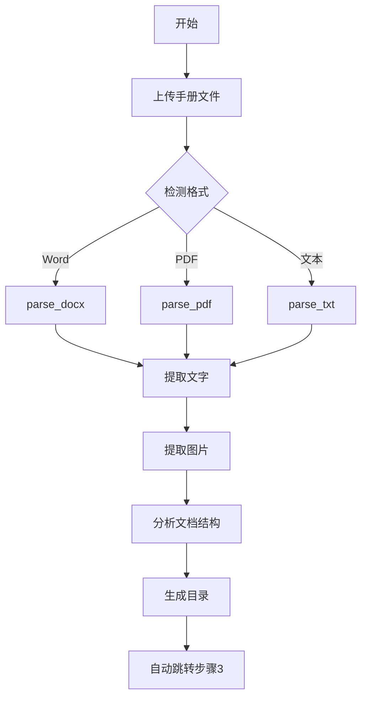
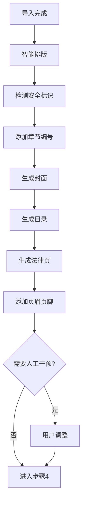
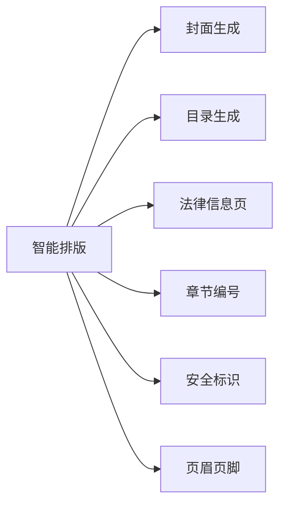
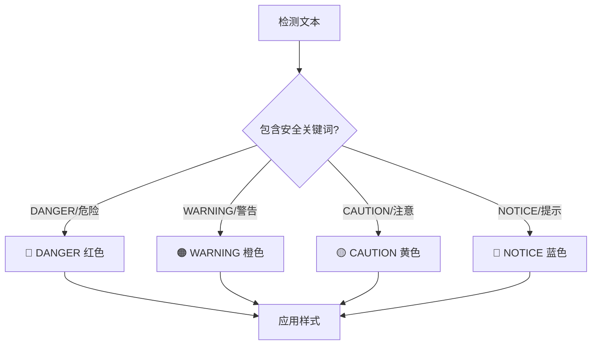
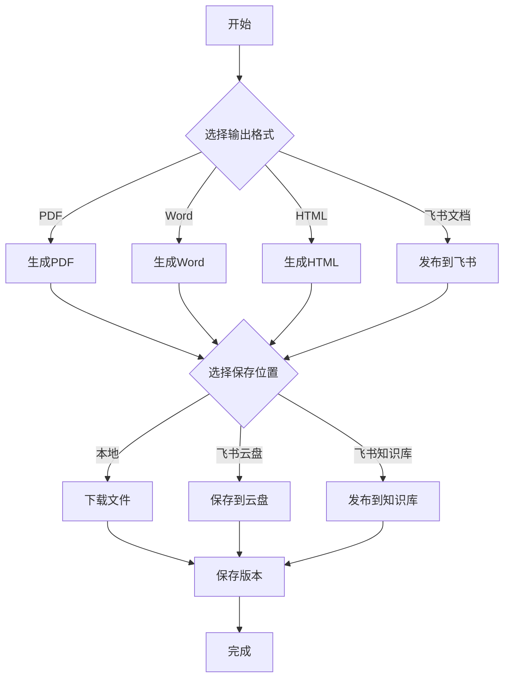
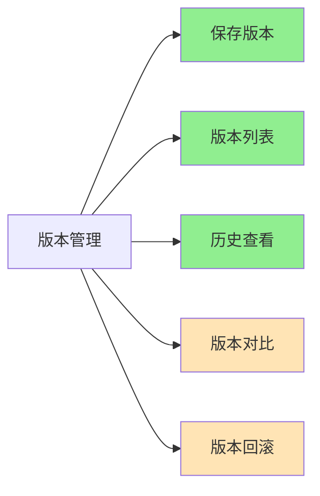
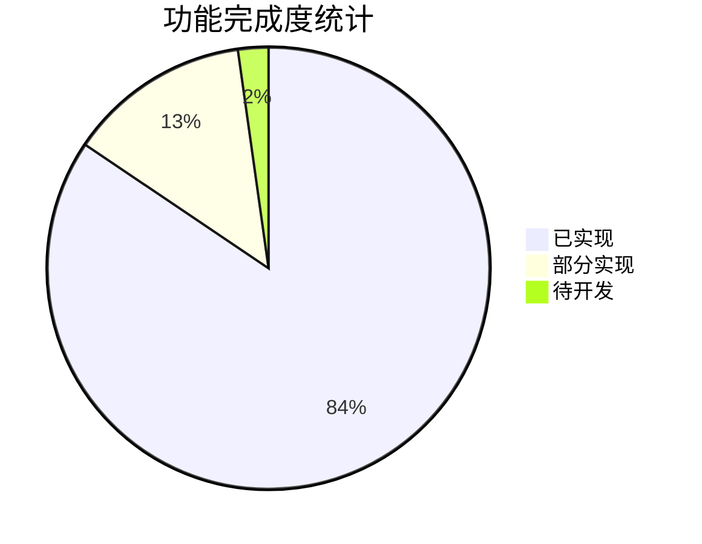

# 手册排版工作流 v2.1 - Mermaid 流程图

## 整体流程


## 步骤0：文档设置



### 功能清单

| 功能 | API | 状态 |
|-----|-----|------|
| 文档编号生成 | `/api/settings/generate_doc_number` | ✅ |
| 版本号设置 | `/api/settings/create` | ✅ |
| 发布日期设置 | `/api/settings/create` | ✅ |
| 产品名称/型号 | `/api/settings/create` | ✅ |
| 公司信息 | `/api/settings/create` | ✅ |
| 公司Logo上传 | 文件上传 | ✅ |
| 安全标识配置 | `/api/safety/levels` | ✅ |
| 页眉页脚模板 | `/api/settings/create` | ✅ |
| 多语言选择 | `/api/settings/create` | ✅ |

## 步骤1：模板选择



### 功能清单

| 功能 | API | 状态 |
|-----|-----|------|
| 本地上传模板 | `/api/import/file` | ✅ |
| 飞书云盘选择 | `/api/import/feishu` | ✅ |
| 模板样式解析 | `parse_docx/parse_pdf` | ✅ |
| 主色调提取 | 集成在解析中 | ⚠️ 部分 |
| Canvas 预览 | 前端 `updatePreview()` | ✅ |

## 步骤2：导入手册



### 功能清单

| 功能 | API | 状态 |
|-----|-----|------|
| Word 解析 | `parse_docx()` | ✅ |
| PDF 解析 | `parse_pdf()` | ✅ |
| 文本解析 | `parse_txt()` | ✅ |
| 图片提取 | 集成在解析中 | ✅ |
| OCR 识别 | 依赖 PyMuPDF | ✅ |
| 文档结构分析 | `generate_toc()` | ✅ |
| 自动进入步骤3 | 前端流程控制 | ✅ |

## 步骤3：智能排版



### 自动功能



### 功能清单

| 功能 | API/函数 | 状态 |
|-----|---------|------|
| 封面生成 | `/api/cover/generate` | ✅ |
| 目录生成 | `/api/toc/generate` | ✅ |
| 法律信息页 | `/api/legal/generate` | ✅ |
| 章节编号 | `add_chapter_numbers()` | ✅ |
| 安全标识检测 | `/api/safety/detect` | ✅ |
| 页眉页脚 | `add_header_footer()` | ✅ |
| 智能排版 | `/api/layout/smart` | ✅ |

### 安全标识系统



| 级别 | 颜色 | 说明 |
|-----|------|------|
| DANGER | 🔴 #FF0000 | 危险 - 不避免将导致死亡或重伤 |
| WARNING | 🟠 #FF8C00 | 警告 - 不避免可能导致死亡或重伤 |
| CAUTION | 🟡 #FFD700 | 注意 - 不避免可能导致伤害或设备损坏 |
| NOTICE | 🔵 #1E90FF | 提示 - 不遵守可能导致设备损坏 |

### 人工干预功能

| 功能 | 实现方式 | 状态 |
|-----|---------|------|
| 图片调整 | 前端编辑器 | ⚠️ 基础 |
| 段落调整 | 前端编辑器 | ✅ |
| 表格编辑 | 前端编辑器 | ⚠️ 基础 |
| 字体调整 | 前端样式面板 | ⚠️ 基础 |
| 颜色调整 | 前端样式面板 | ⚠️ 基础 |

## 步骤4：手册输出



### 输出格式

| 格式 | API | 状态 |
|-----|-----|------|
| PDF 打印版 | `/api/export/pdf` | ✅ |
| PDF 浏览版 | `/api/export/pdf` | ✅ |
| HTML 网页 | `/api/export/pdf` 返回 HTML | ✅ |
| Word 文档 | `/api/export/word` | ✅ |
| 飞书文档 | `/api/feishu/publish` | ✅ |

### 保存位置

| 位置 | 实现方式 | 状态 |
|-----|---------|------|
| 本地下载 | 浏览器下载 | ✅ |
| 飞书云盘 | `/api/feishu/publish` | ✅ |
| 飞书知识库 | `/api/feishu/publish` | ✅ |

### 版本管理



| 功能 | API | 状态 |
|-----|-----|------|
| 保存版本 | `/api/version/save` | ✅ |
| 版本列表 | `/api/version/list` | ✅ |
| 历史查看 | 前端展示 | ⚠️ 基础 |
| 版本对比 | 未实现 | ❌ 待开发 |
| 版本回滚 | 未实现 | ❌ 待开发 |

## API 接口总览

```mermaid
graph TB
    subgraph 步骤0
        A1[/api/settings/create]
        A2[/api/settings/get]
        A3[/api/settings/generate_doc_number]
    end
    
    subgraph 步骤1
        B1[/api/import/file]
        B2[/api/import/feishu]
    end
    
    subgraph 步骤2
        C1[parse_docx]
        C2[parse_pdf]
        C3[parse_txt]
    end
    
    subgraph 步骤3
        D1[/api/layout/smart]
        D2[/api/cover/generate]
        D3[/api/toc/generate]
        D4[/api/legal/generate]
        D5[/api/safety/detect]
    end
    
    subgraph 步骤4
        E1[/api/export/pdf]
        E2[/api/export/word]
        E3[/api/feishu/publish]
        E4[/api/version/save]
        E5[/api/version/list]
    end
```

## 功能完成度统计



| 步骤 | 功能数 | 已实现 | 部分实现 | 待开发 |
|-----|-------|-------|---------|-------|
| 步骤0 | 9 | 9 | 0 | 0 |
| 步骤1 | 5 | 4 | 1 | 0 |
| 步骤2 | 7 | 7 | 0 | 0 |
| 步骤3 | 12 | 8 | 4 | 0 |
| 步骤4 | 12 | 10 | 1 | 1 |
| **总计** | **45** | **38** | **6** | **1** |

**完成度：84%** ✅

## 待完善功能

| 功能 | 优先级 | 建议 |
|-----|-------|------|
| 模板主色调自动提取 | 中 | 可用 PIL 库分析图片颜色 |
| 图片拖拽调整 | 中 | 前端添加拖拽组件 |
| 表格编辑增强 | 低 | 可用第三方表格编辑器 |
| 版本对比 | 低 | 需要 diff 算法 |
| 版本回滚 | 低 | 简单实现 |

---

**文档版本：** v2.1  
**更新日期：** 2026-03-19  
**作者：** Banana 🍌🦀