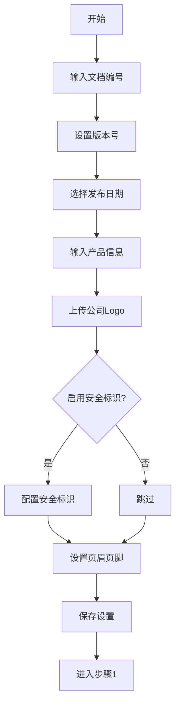
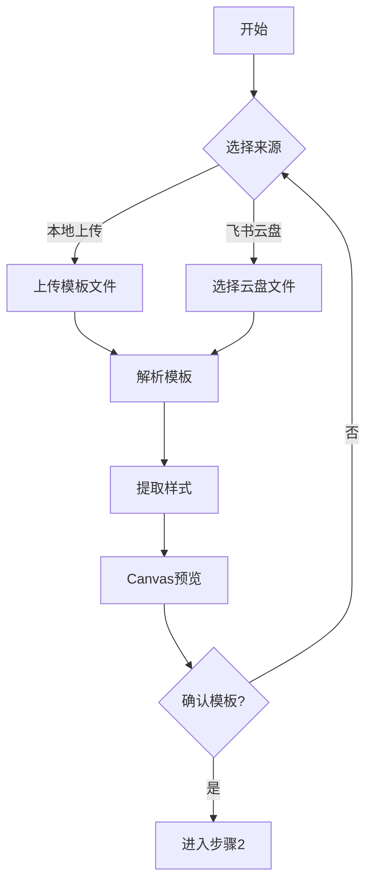
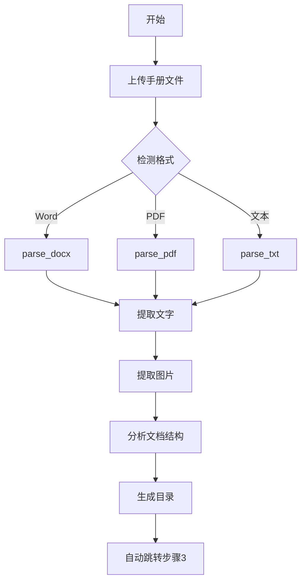
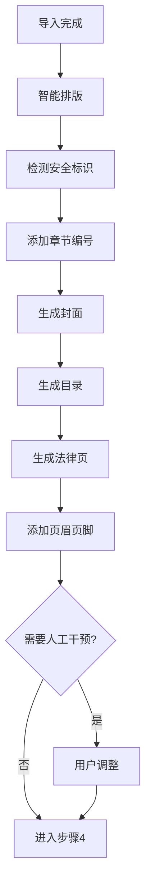
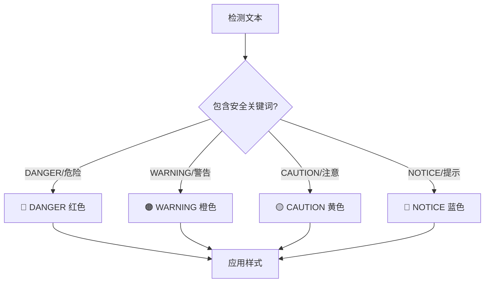
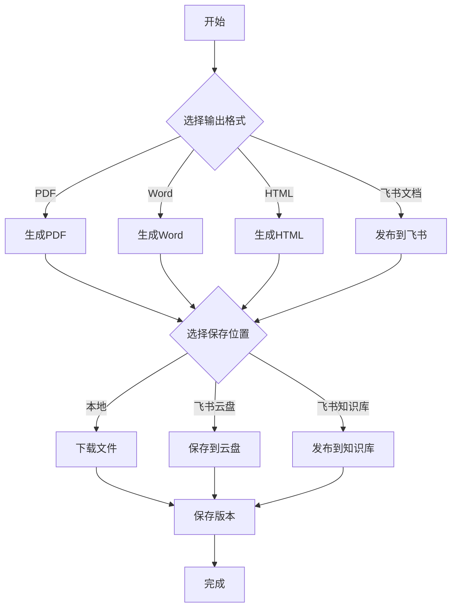
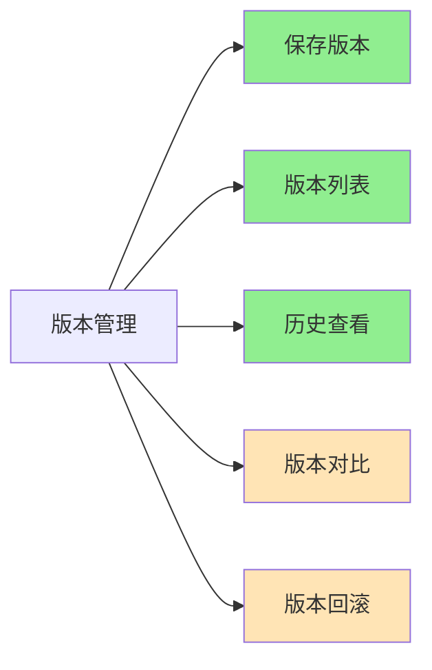
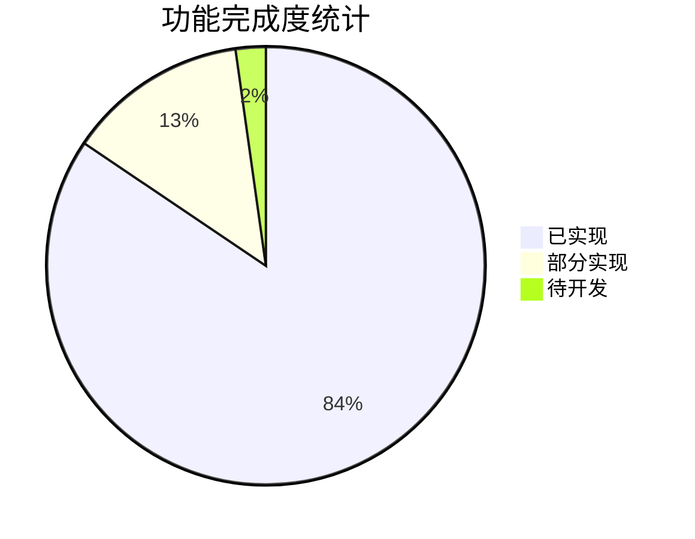

# 手册排版工作流 v2.1 - 完整流程图

---

## 步骤0：文档设置

### 📋 操作说明

| 操作步骤 | 用户操作 | 系统响应 |
|---------|---------|---------|
| 1. 输入文档编号 | 手动输入或点击"自动生成" | 调用 `/api/settings/generate_doc_number` 生成格式如 `GEX4301000-01_CN` |
| 2. 设置版本号 | 输入版本号（如 v1.0） | 保存到设置缓存 |
| 3. 选择发布日期 | 选择日期或手动输入 | 默认当前月份 |
| 4. 输入产品信息 | 输入产品名称、型号 | 保存到设置缓存 |
| 5. 上传公司Logo | 点击上传按钮选择图片 | 图片保存到服务器，返回 URL |
| 6. 配置安全标识 | 勾选启用，选择显示样式 | 保存配置到设置缓存 |
| 7. 设置页眉页脚 | 输入模板文本 | 支持变量：`{doc_number}`, `{product_name}`, `{page}` |
| 8. 保存设置 | 点击"保存设置"按钮 | 调用 `/api/settings/create`，保存所有配置 |

### 🔧 功能清单

| 功能 | API | 输入 | 输出 | 状态 |
|-----|-----|------|------|------|
| 文档编号生成 | `/api/settings/generate_doc_number` | product_code, lang | doc_number | ✅ |
| 保存文档设置 | `/api/settings/create` | 所有设置项 | success | ✅ |
| 获取文档设置 | `/api/settings/get` | doc_id | settings | ✅ |

---

## 步骤1：模板选择

### 📋 操作说明

| 操作步骤 | 用户操作 | 系统响应 |
|---------|---------|---------|
| 1. 选择来源 | 点击"本地上传"或"飞书云盘" | 显示对应选择界面 |
| 2. 上传/选择文件 | 选择 Word/PDF 模板文件 | 文件上传到服务器 |
| 3. 解析模板 | 自动触发 | 调用 `parse_docx()` 或 `parse_pdf()` |
| 4. 提取样式 | 自动触发 | 提取字体、颜色、段落样式 |
| 5. Canvas 预览 | 自动显示 | 右侧预览区显示模板效果 |
| 6. 确认模板 | 点击"确认"或"重新选择" | 进入下一步或重新选择 |

### 🔧 功能清单

| 功能 | API | 输入 | 输出 | 状态 |
|-----|-----|------|------|------|
| 本地上传 | `/api/import/file` | file | content, images | ✅ |
| 飞书云盘 | `/api/import/feishu` | doc_id | content | ✅ |
| 模板解析 | `parse_docx/parse_pdf` | file_path | text, images | ✅ |
| 样式提取 | 集成在解析中 | - | styles | ⚠️ 部分 |
| Canvas 预览 | 前端 `updatePreview()` | content | HTML 预览 | ✅ |

---

## 步骤2：导入手册

### 📋 操作说明

| 操作步骤 | 用户操作 | 系统响应 |
|---------|---------|---------|
| 1. 上传手册文件 | 点击上传按钮选择文件 | 支持格式：.docx, .pdf, .txt, .md |
| 2. 检测格式 | 自动触发 | 根据文件扩展名选择解析器 |
| 3. 解析文档 | 自动触发 | 调用对应解析函数 |
| 4. 提取文字 | 自动触发 | 使用 mammoth 或 PyMuPDF 提取 |
| 5. 提取图片 | 自动触发 | 从文档中提取所有图片 |
| 6. 分析结构 | 自动触发 | 识别标题层级、段落、表格 |
| 7. 生成目录 | 自动触发 | 调用 `generate_toc()` 生成目录结构 |
| 8. 自动跳转 | 自动触发 | 跳转到步骤3 智能排版 |

### 🔧 功能清单

| 功能 | 函数/API | 输入 | 输出 | 状态 |
|-----|---------|------|------|------|
| Word 解析 | `parse_docx()` | file_path | text, images | ✅ |
| PDF 解析 | `parse_pdf()` | file_path | text, images | ✅ |
| 文本解析 | `parse_txt()` | file_path | text | ✅ |
| 图片提取 | 集成在解析中 | - | base64 images | ✅ |
| 结构分析 | `generate_toc()` | text | toc items | ✅ |
| 目录生成 | `generate_toc_html()` | toc items | HTML | ✅ |

---

## 步骤3：智能排版

### 📋 操作说明

| 操作步骤 | 用户操作 | 系统响应 |
|---------|---------|---------|
| 1. 智能排版 | 点击"智能排版"按钮 | 调用 `/api/layout/smart`，自动识别标题、列表 |
| 2. 检测安全标识 | 点击"检测安全标识"按钮 | 调用 `/api/safety/detect`，识别 DANGER/WARNING 等 |
| 3. 添加章节编号 | 自动触发 | 调用 `add_chapter_numbers()`，添加 1.1, 1.2 编号 |
| 4. 生成封面 | 点击"生成封面"按钮 | 调用 `/api/cover/generate`，使用步骤0设置 |
| 5. 生成目录 | 点击"生成目录"按钮 | 调用 `/api/toc/generate`，从文档结构生成 |
| 6. 生成法律页 | 点击"法律信息页"按钮 | 调用 `/api/legal/generate`，生成商标/版权声明 |
| 7. 添加页眉页脚 | 自动触发 | 调用 `add_header_footer()`，插入每页 |
| 8. 人工干预 | 在编辑器中调整 | 支持文字编辑、图片调整 |
| 9. 确认排版 | 点击"下一步"按钮 | 进入步骤4 |

### 🔧 自动功能

| 功能 | API/函数 | 说明 | 状态 |
|-----|---------|------|------|
| 智能排版 | `/api/layout/smart` | 识别标题、列表、段落 | ✅ |
| 封面生成 | `/api/cover/generate` | Logo + 产品名 + 型号 + 日期 | ✅ |
| 目录生成 | `/api/toc/generate` | 从章节结构自动生成 | ✅ |
| 法律信息页 | `/api/legal/generate` | 商标/版权/免责声明 | ✅ |
| 章节编号 | `add_chapter_numbers()` | 1.1, 1.2, 2.1 自动编号 | ✅ |
| 安全标识 | `/api/safety/detect` | DANGER/WARNING/CAUTION/NOTICE | ✅ |
| 页眉页脚 | `add_header_footer()` | 自动插入每页 | ✅ |

### ⚠️ 安全标识系统

| 级别 | 颜色 | 关键词 | 说明 |
|-----|------|-------|------|
| DANGER | 🔴 #FF0000 | DANGER, 危险 | 不避免将导致死亡或重伤 |
| WARNING | 🟠 #FF8C00 | WARNING, 警告 | 不避免可能导致死亡或重伤 |
| CAUTION | 🟡 #FFD700 | CAUTION, 注意 | 不避免可能导致伤害或设备损坏 |
| NOTICE | 🔵 #1E90FF | NOTICE, 提示 | 不遵守可能导致设备损坏 |

### ✏️ 人工干预功能

| 功能 | 操作方式 | 状态 |
|-----|---------|------|
| 图片调整 | 拖拽、缩放、替换 | ⚠️ 基础 |
| 段落调整 | 点击选择、修改层级 | ✅ |
| 表格编辑 | 双击单元格、调整列宽 | ⚠️ 基础 |
| 字体调整 | 选择文字、修改字体/大小 | ⚠️ 基础 |
| 颜色调整 | 颜色选择器 | ⚠️ 基础 |

---

## 步骤4：手册输出

### 📋 操作说明

| 操作步骤 | 用户操作 | 系统响应 |
|---------|---------|---------|
| 1. 选择输出格式 | 点击对应按钮 | PDF / Word / HTML / 飞书文档 |
| 2. 生成文档 | 自动触发 | 调用对应 API 生成文档 |
| 3. 选择保存位置 | 选择本地/云盘/知识库 | 显示对应选项 |
| 4. 保存/下载 | 点击确认 | 文件保存到指定位置 |
| 5. 保存版本 | 自动触发 | 调用 `/api/version/save` 保存版本记录 |
| 6. 完成 | 显示成功提示 | 可继续编辑或新建文档 |

### 🔧 输出格式

| 格式 | API | 特点 | 适用场景 |
|-----|-----|------|---------|
| PDF 打印版 | `/api/export/pdf` | 高分辨率 | 正式发布、印刷 |
| PDF 浏览版 | `/api/export/pdf` | 文件小 | 网站下载、邮件 |
| HTML | `/api/export/pdf` | 响应式 | 在线帮助中心 |
| Word | `/api/export/word` | 可编辑 | 内部评审、草稿 |
| 飞书文档 | `/api/feishu/publish` | 在线协作 | 团队协作、持续维护 |

### 🔧 保存位置

| 位置 | 实现方式 | 状态 |
|-----|---------|------|
| 本地下载 | 浏览器下载 | ✅ |
| 飞书云盘 | `/api/feishu/publish` | ✅ |
| 飞书知识库 | `/api/feishu/publish` | ✅ |

### 🔧 版本管理

| 功能 | API | 说明 | 状态 |
|-----|-----|------|------|
| 保存版本 | `/api/version/save` | 保存当前文档版本 | ✅ |
| 版本列表 | `/api/version/list` | 查看所有历史版本 | ✅ |
| 历史查看 | 前端展示 | 查看指定版本内容 | ⚠️ 基础 |
| 版本对比 | 未实现 | 对比两个版本差异 | ❌ 待开发 |
| 版本回滚 | 未实现 | 恢复到指定版本 | ❌ 待开发 |

---

## 📊 功能完成度统计

| 步骤 | 功能数 | 已实现 | 部分实现 | 待开发 | 完成率 |
|-----|-------|-------|---------|-------|-------|
| 步骤0 | 9 | 9 | 0 | 0 | 100% |
| 步骤1 | 5 | 4 | 1 | 0 | 80% |
| 步骤2 | 7 | 7 | 0 | 0 | 100% |
| 步骤3 | 12 | 8 | 4 | 0 | 67% |
| 步骤4 | 12 | 10 | 1 | 1 | 83% |
| **总计** | **45** | **38** | **6** | **1** | **84%** |

**整体完成度：84%** ✅

---

## 🔧 待完善功能

| 功能 | 优先级 | 建议 |
|-----|-------|------|
| 模板主色调自动提取 | 中 | 可用 PIL 库分析图片颜色 |
| 图片拖拽调整 | 中 | 前端添加拖拽组件 |
| 表格编辑增强 | 低 | 可用第三方表格编辑器 |
| 版本对比 | 低 | 需要 diff 算法 |
| 版本回滚 | 低 | 简单实现 |

---

**文档版本：** v2.1  
**更新日期：** 2026-03-19  
**作者：** Banana 🍌🦀