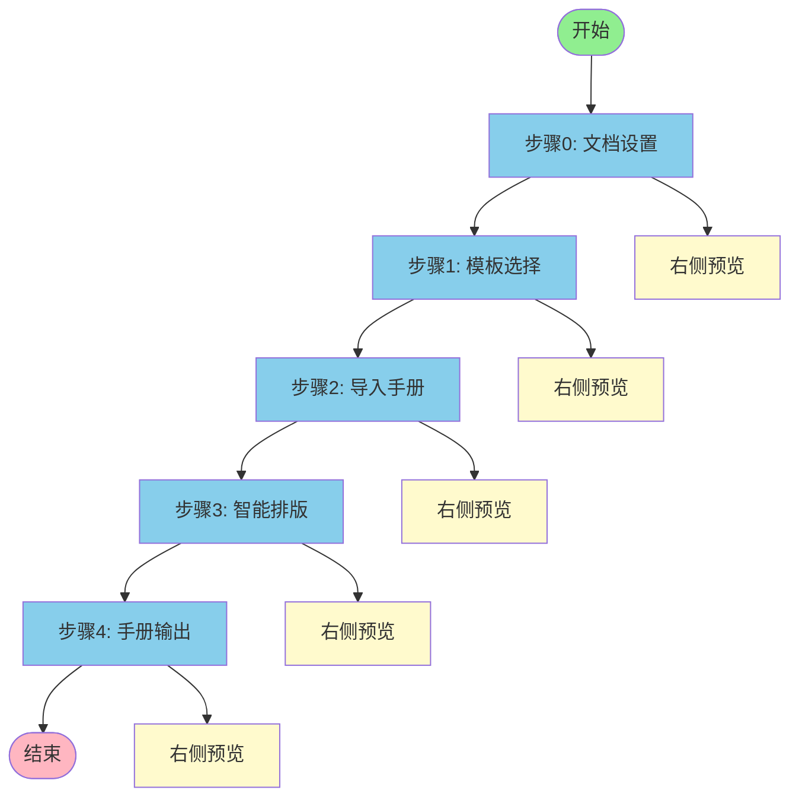
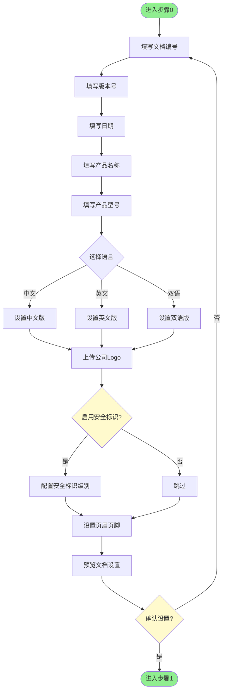
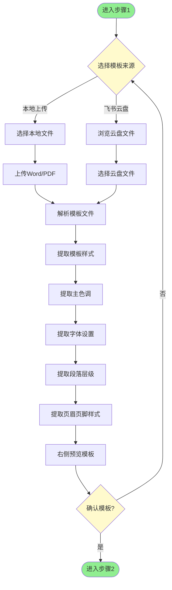
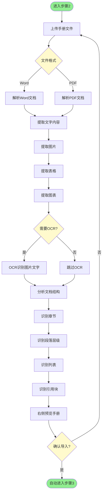
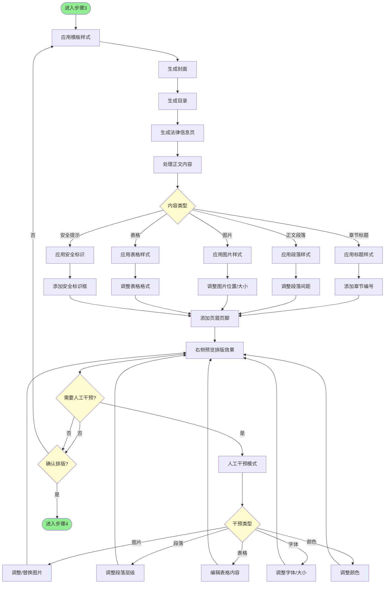
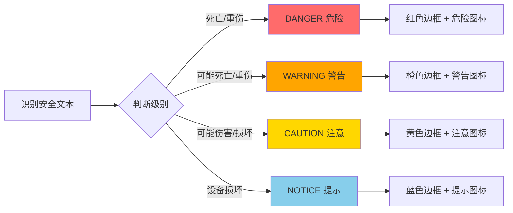
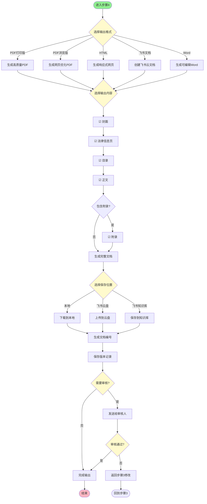
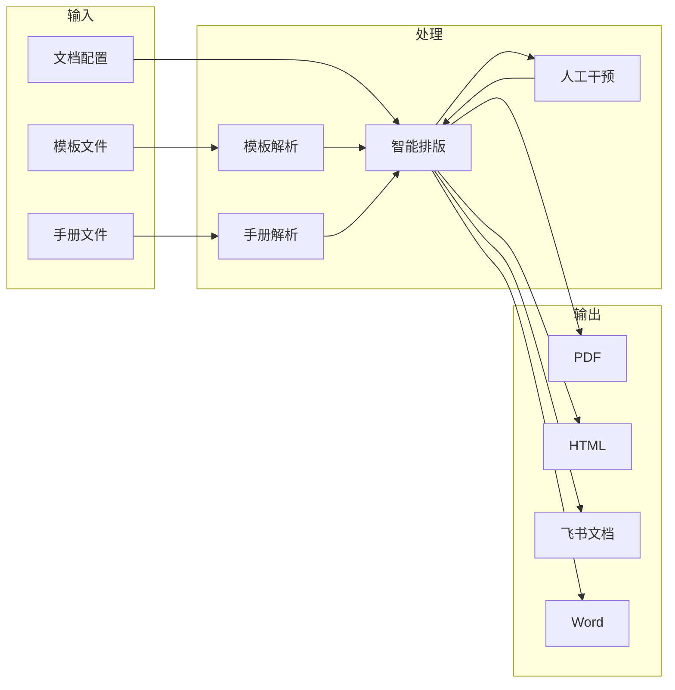
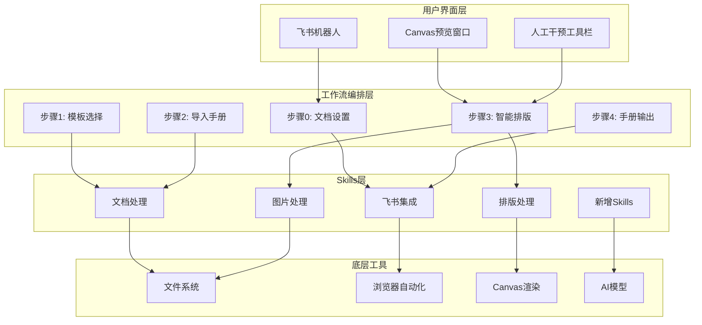
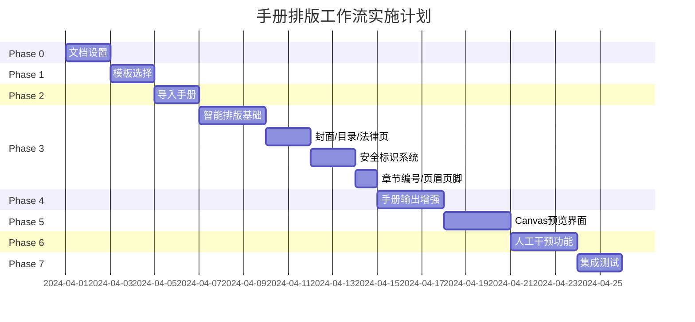

# 📋 手册排版工作流 v2.1 流程图

## 一、整体流程图

---

## 二、步骤0：文档设置

### 步骤0 配置项

| 配置项 | 说明 | 示例 |
|-------|------|------|
| 文档编号 | 唯一标识 | GEX4301000-01_CN |
| 版本号 | 文档版本 | v1.0 |
| 日期 | 发布日期 | 2024-05 |
| 产品名称 | 产品全称 | EVlink Pro DC 180 充电站 |
| 产品型号 | 型号代码 | GEX4301000 |
| 语言版本 | 中文/英文/双语 | 中文 |
| 公司Logo | 品牌标识 | 上传图片 |
| 安全标识 | 四级标识配置 | DANGER/WARNING/CAUTION/NOTICE |
| 页眉页脚 | 每页显示内容 | 文档编号 + 页码 |

---

## 三、步骤1：模板选择

### 模板解析内容

| 解析项 | 说明 | 提取方式 |
|-------|------|---------|
| 主色调 | 品牌色/主题色 | 颜色分析算法 |
| 字体 | 标题/正文字体 | 字体识别 |
| 段落层级 | H1/H2/H3/P样式 | 样式继承分析 |
| 页眉页脚 | 布局和内容 | 区域识别 |
| 安全标识 | 标识样式 | 模板匹配 |

---

## 四、步骤2：导入手册

### 手册解析内容

| 解析项 | 说明 | 处理方式 |
|-------|------|---------|
| 文字内容 | 正文、标题、说明 | 文本提取 |
| 图片 | 产品图、示意图、流程图 | 图片提取+OCR |
| 表格 | 参数表、规格表 | 表格识别 |
| 图表 | 数据图表 | 图表识别 |
| 章节 | 章节结构 | 标题层级分析 |
| 段落 | 段落层级 | 样式继承分析 |

---

## 五、步骤3：智能排版

### 智能排版功能

| 功能 | 说明 | 自动/手动 |
|-----|------|----------|
| 封面生成 | Logo+产品名+型号+日期 | 自动 |
| 目录生成 | 从章节结构生成 | 自动 |
| 法律信息页 | 商标/版权/免责声明 | 自动 |
| 章节编号 | 1.1/1.2/2.1自动编号 | 自动 |
| 安全标识 | DANGER/WARNING/CAUTION/NOTICE | 自动识别+手动调整 |
| 页眉页脚 | 自动插入每页 | 自动 |
| 图片调整 | 位置/大小/替换 | 手动 |
| 段落调整 | 层级/间距 | 手动 |
| 表格编辑 | 内容/格式 | 手动 |
| 字体调整 | 字体/大小/颜色 | 手动 |

### 安全标识系统

---

## 六、步骤4：手册输出

### 输出格式对比

| 格式 | 特点 | 适用场景 |
|-----|------|---------|
| PDF打印版 | 高分辨率，适合打印 | 正式发布、印刷 |
| PDF浏览版 | 文件小，适合在线查看 | 网站下载、邮件发送 |
| HTML | 响应式，支持交互 | 在线帮助中心 |
| 飞书文档 | 在线协作，实时更新 | 团队协作、持续维护 |
| Word | 可编辑，方便修改 | 内部评审、草稿 |

---

## 七、完整数据流图

---

## 八、技术架构图

---

## 九、实施时间线

---

## 十、关键Skills清单

| Skill名称 | 功能 | 优先级 | 状态 |
|----------|------|-------|------|
| `feishu_drive_file` | 飞书云盘文件管理 | 高 | ✅ 已有 |
| `miaoda-doc-parse` | 文档解析 | 高 | ✅ 已有 |
| `document-ocr` | 文档OCR | 高 | ✅ 已有 |
| `manual-typesetting` | 手册排版 | 高 | ✅ 已有 |
| `smart-image` | 智能图片处理 | 高 | ✅ 已有 |
| `pdf-generator` | PDF生成 | 高 | ✅ 已有 |
| `cover-generator` | 封面生成 | 高 | 🆕 待开发 |
| `toc-generator` | 目录生成 | 高 | 🆕 待开发 |
| `safety-labels` | 安全标识系统 | 高 | 🆕 待开发 |
| `legal-templates` | 法律信息模板 | 中 | 🆕 待开发 |
| `version-manager` | 版本管理 | 中 | 🆕 待开发 |
| `multi-language` | 多语言支持 | 中 | 🆕 待开发 |

---

**文档版本：** v2.1  
**更新日期：** 2024-03-19  
**作者：** Banana 🦀